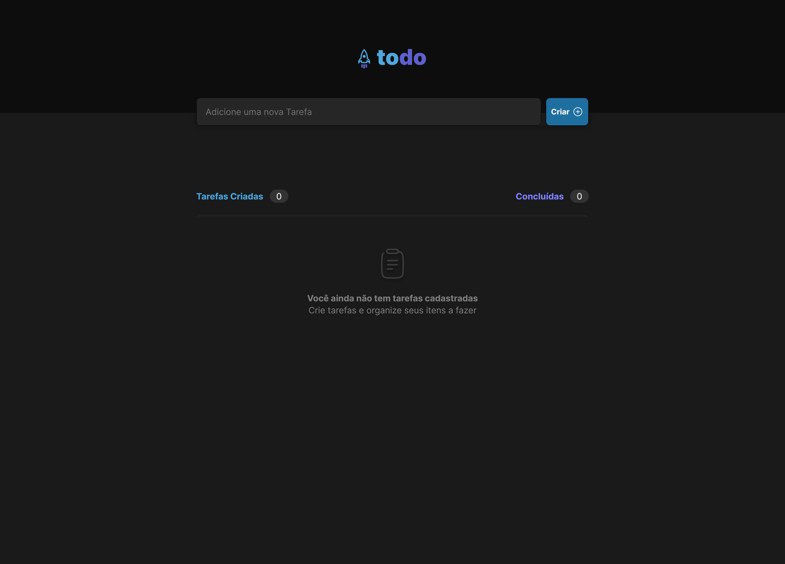

# ToDo List


<a href="https://todo-list-sid.netlify.app/" target="_blank">Demo</a>


<br /> 
 
## 💻 Sobre

Este projeto é uma lista de tarefas (Todo list) desenvolvida usando React e Vite. Ele foi criado como um desafio do curso Ignite, e tem como objetivo proporcionar aos usuários uma maneira simples e eficiente de gerenciar suas tarefas diárias. A aplicação permite que os usuários adicionem, edite e removam tarefas, marcando-as como concluídas ou pendentes. Além disso, a lista de tarefas tem uma barra de pesquisa para facilitar a encontrar tarefas específicas e uma opção para organizar as tarefas por data de criação ou data de vencimento. O projeto foi desenvolvido com o objetivo de ajudar os usuários a se manterem organizados e produtivos.

<br />

## 🖱 Pré-requisitos

Antes de começar, verifique se você atendeu aos seguintes requisitos:

- Você instalou a versão mais recente de `node / npm / yarn`
  <br />

## ☕ Usando a ToDo List

Para usar a ToDo List, siga estas etapas:

```
git clone https://github.com/SidneyRoberto9/ToDoList-Ignite

yarn ou npm i

yarn start ou npm start
```
